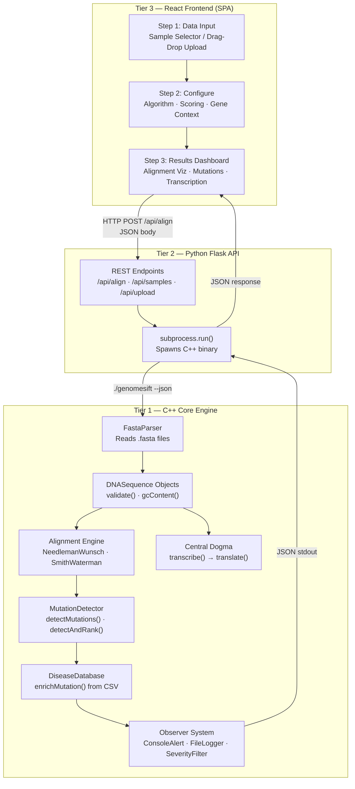
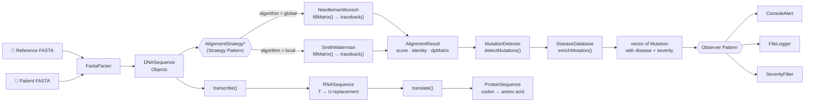
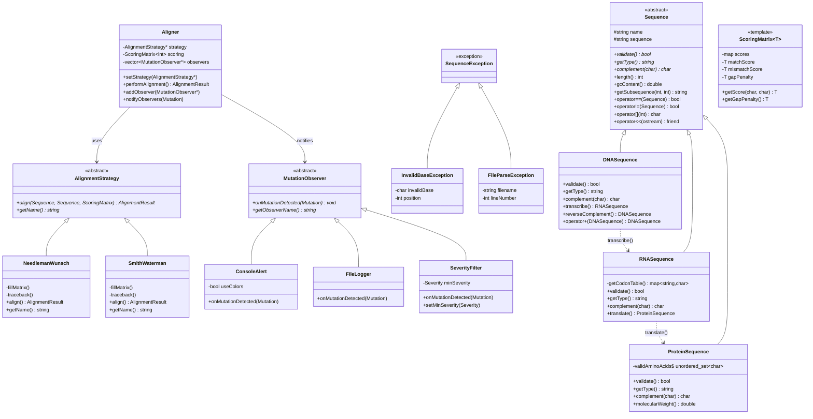
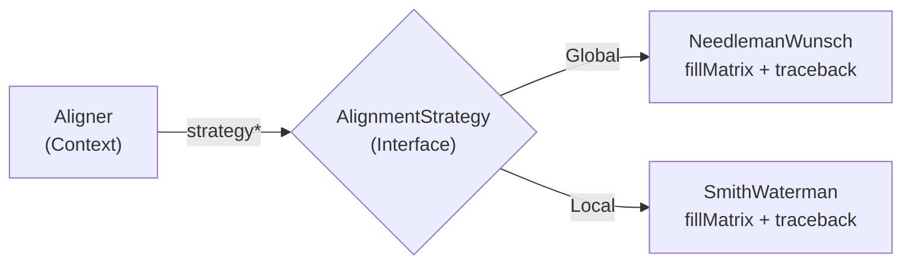
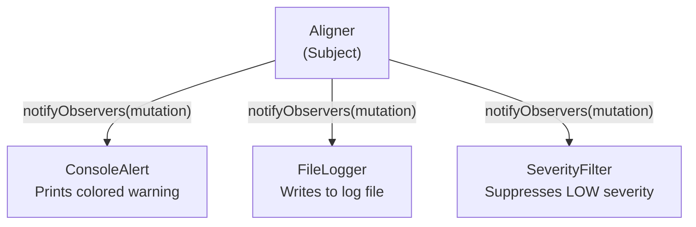

# 🧬 GenomeSift

### A High-Performance DNA Sequence Alignment & Mutation Detection Engine

> **C++17 Core** · **13+ OOP Concepts** · **Strategy + Observer Patterns** · **React + Flask UI**

GenomeSift is a three-tier bioinformatics pipeline that aligns DNA sequences using classical dynamic programming algorithms, detects disease-linked genetic mutations, and simulates the Central Dogma of molecular biology — powered by a high-performance C++ engine with a modern web interface.

<p align="center">
  
  
  
  
</p>

---

## Table of Contents

- [The Problem](#the-problem)
- [Why C++](#why-c-is-non-negotiable)
- [System Architecture](#system-architecture)
- [Data Flow Pipeline](#data-flow-pipeline)
- [C++ Class Hierarchy](#c-class-hierarchy)
- [OOP Concepts and Design Patterns](#oop-concepts-and-design-patterns)
- [Core Algorithms](#core-algorithms)
- [Project Structure](#project-structure)
- [Getting Started](#getting-started)
- [Usage](#usage)
- [Supported Gene Databases](#supported-gene-databases)
- [How Other / Discover Mode Works](#how-other--discover-mode-works)
- [Development Challenges](#development-challenges)
- [Tech Stack](#tech-stack)

---

## The Problem

Every human has approximately 3.2 billion base pairs of DNA. Within those billions of letters (A, T, G, C), a **single nucleotide change** can cause devastating disease. A child born with sickle cell anemia has just one nucleotide changed — the 6th codon of the HBB gene reads `GTG` instead of `GAG`. One letter. One life altered.

**How do you find that one letter among billions?** You align two sequences — a healthy reference and a patient's sample — and compare them position by position. This is **pairwise sequence alignment**, the foundational problem in all of bioinformatics.

| Statistic | Scale |
|-----------|-------|
| Thalassemia carriers in India | **70 million+** (1 in 20) |
| Sickle cell births per year | **10,000+** |
| Access to genomic tools in rural India | Virtually **zero** |
| Cost of commercial screening tools | **Prohibitively expensive** |

GenomeSift makes high-performance mutation screening accessible through clean, well-architected C++.

---

## Why C++ Is Non-Negotiable

DNA alignment uses dynamic programming over massive matrices. For two sequences of length 1,000, you compute **1,000,000 cells**. For real genomic fragments (10K+ bases), that is over **100 million operations**.

| Language | DP Computations/sec | Relative Speed |
|----------|---------------------|----------------|
| Python   | ~10,000             | 1×             |
| Java     | ~1,000,000          | 100×           |
| **C++**  | **~10,000,000+**    | **1,000×**     |

Every production bioinformatics tool (BLAST, BWA, Bowtie2, minimap2) is written in C/C++. GenomeSift uses C++ because **the domain demands it**.

---

## System Architecture

GenomeSift is a three-tier system: the C++ engine handles computation, Flask orchestrates communication, and React renders results.



**Tier 1 — C++ Core Engine:** Implements Needleman-Wunsch (global) and Smith-Waterman (local) alignment via dynamic programming. Parses FASTA input into structured `DNASequence` objects, detects mutations base-by-base, maps them against a local disease CSV database, and simulates the Central Dogma (DNA → RNA → Protein via codon table lookup). Supports both an interactive terminal menu and `--json` output mode.

**Tier 2 — Python Flask API:** A lightweight REST wrapper. When `/api/align` is called, Flask spawns `./genomesift --json ...` via `subprocess`, captures the structured JSON from stdout, and forwards it to the frontend. Also serves sample FASTA files and handles drag-and-drop file uploads.

**Tier 3 — React SPA:** Component-driven interface styled with Tailwind CSS in a dark "biotech lab" aesthetic. Renders base-by-base color-coded alignment tracks (green = match, red = SNP, amber = gap), severity-graded mutation cards with disease associations, the Central Dogma chain with amino acid badges, and a severity profile bar.

---

## Data Flow Pipeline



---

## C++ Class Hierarchy



---

## OOP Concepts and Design Patterns

GenomeSift implements **13+ distinct OOP concepts** across its C++ codebase. Every pattern was chosen to solve a specific bioinformatics problem, not for checkbox compliance.

---

### 1. Inheritance (Multi-Level Hierarchy)

The `Sequence` abstract base class defines the shared interface for all biological sequence types. Three derived classes specialize it for DNA, RNA, and Protein — each with different validation rules, base alphabets, and biological operations.

```
Sequence (abstract base)
├── DNASequence      → validates A, T, G, C → has transcribe(), reverseComplement()
├── RNASequence      → validates A, U, G, C → has translate() with full codon table
└── ProteinSequence  → validates 20 amino acids → has molecularWeight()
```

**Why:** DNA, RNA, and Protein are fundamentally different molecules with different alphabets (`T` in DNA vs `U` in RNA), but they all share `name`, `sequence`, `length()`, and `gcContent()`. Inheritance avoids duplicating this shared logic across three classes.

**Code location:** `include/sequence/Sequence.h` → `DNASequence.h`, `RNASequence.h`, `ProteinSequence.h`

---

### 2. Abstraction (Pure Virtual Functions)

The `Sequence` class declares three pure virtual functions that every derived class **must** implement:

```cpp
virtual bool validate() const = 0;       // Each sequence type has different valid bases
virtual std::string getType() const = 0;  // Returns "DNA", "RNA", or "Protein"
virtual char complement(char base) const = 0; // A↔T in DNA, A↔U in RNA, N/A in Protein
```

Similarly, `AlignmentStrategy` declares:
```cpp
virtual AlignmentResult align(const Sequence& seq1, const Sequence& seq2, 
                               const ScoringMatrix<int>& scoring) = 0;
virtual std::string getName() const = 0;
```

And `MutationObserver` declares:
```cpp
virtual void onMutationDetected(const Mutation& mutation) = 0;
virtual std::string getObserverName() const = 0;
```

**Why:** The Aligner doesn't need to know whether it's aligning DNA or Protein — it works on `Sequence&`. The Strategy pattern works because `Aligner` calls `strategy->align()` without knowing the concrete algorithm. Abstraction makes GenomeSift extensible without modifying existing code.

---

### 3. Encapsulation

Every class in GenomeSift uses `private` data members with public getters/setters. The `Mutation` class demonstrates this thoroughly:

```cpp
class Mutation {
private:
    int position;
    char reference;
    char variant;
    std::string type;          // "SNP", "Insertion", "Deletion"
    Severity severity;
    std::string geneContext;
    std::string diseaseAssociation;

public:
    int getPosition() const;
    void setSeverity(Severity s);
    void setDiseaseAssociation(const std::string& disease);
    // ...
};
```

**Why:** The `DiseaseDatabase::enrichMutation()` method modifies severity and disease association through setters — external code cannot directly write to `position` or `type` after construction, maintaining data integrity. If a mutation is at position 19, nothing can change that after detection.

**Code location:** `include/mutation/Mutation.h`

---

### 4. Polymorphism (Runtime)

The `Aligner` holds an `AlignmentStrategy*` pointer. At runtime, the user selects "Global" or "Local" from the UI, and the same `performAlignment()` call dispatches to the correct algorithm:

```cpp
class Aligner {
private:
    AlignmentStrategy* strategy;  // Points to NeedlemanWunsch OR SmithWaterman
public:
    AlignmentResult performAlignment(const Sequence& seq1, const Sequence& seq2) {
        return strategy->align(seq1, seq2, scoring);  // Polymorphic dispatch
    }
};
```

The **same** mechanism applies to observers — `notifyObservers()` calls `onMutationDetected()` on each observer pointer, which dispatches to `ConsoleAlert`, `FileLogger`, or `SeverityFilter` at runtime.

**Code location:** `src/alignment/Aligner.cpp`

---

### 5. Strategy Pattern

The alignment algorithm is **swappable at runtime** without changing any calling code. This is the textbook Strategy Pattern:



```cpp
// In the UI configuration step, the user picks an algorithm:
NeedlemanWunsch nw;
SmithWaterman sw;
aligner.setStrategy(&nw);  // or aligner.setStrategy(&sw);

// The same call works regardless of which algorithm is set:
AlignmentResult result = aligner.performAlignment(refSeq, patientSeq);
```

**Why:** Adding a new algorithm (e.g., Hirschberg for space-optimized alignment) requires creating one new class that inherits from `AlignmentStrategy` — zero changes to `Aligner`, `MutationDetector`, `ReportGenerator`, or the Flask API.

**Code location:** `include/alignment/AlignmentStrategy.h`, `NeedlemanWunsch.h`, `SmithWaterman.h`

---

### 6. Observer Pattern

When a mutation is detected, multiple subsystems need to react independently — the console needs to display alerts, the file logger needs to write records, and the severity filter needs to suppress low-risk noise. The Observer Pattern decouples these responses:



```cpp
// Register observers at startup:
ConsoleAlert console(true);
FileLogger logger("mutations.log");
SeverityFilter filter(Severity::MEDIUM);

aligner.addObserver(&console);
aligner.addObserver(&logger);
aligner.addObserver(&filter);

// When a mutation is found:
aligner.notifyObservers(mutation);  // All three react independently
```

**Why:** The `Aligner` doesn't know or care how many observers exist or what they do. You can add a `WebhookNotifier` or `DatabaseWriter` observer without touching the Aligner class.

**Code location:** `include/observer/MutationObserver.h`, `ConsoleAlert.h`, `FileLogger.h`, `SeverityFilter.h`

---

### 7. Templates (Generic Programming)

`ScoringMatrix<T>` is a class template that stores scoring parameters for alignment. The template parameter `T` allows the matrix to work with `int`, `float`, or `double` scores:

```cpp
template<typename T>
class ScoringMatrix {
private:
    std::map<std::pair<char, char>, T> scores;
    T matchScore;
    T mismatchScore;
    T gapPenalty;
public:
    ScoringMatrix(T match, T mismatch, T gap);
    T getScore(char a, char b) const;
    T getGapPenalty() const;
};
```

**Why:** Research-grade alignment tools sometimes use fractional scores (e.g., BLOSUM62 matrices for protein alignment use `float`). By templating, GenomeSift supports `ScoringMatrix<int>` for DNA and could use `ScoringMatrix<float>` for protein without rewriting the class.

**Code location:** `include/scoring/ScoringMatrix.h` (header-only, as required by C++ templates)

---

### 8. Exception Hierarchy (Custom Exceptions)

GenomeSift defines a three-level exception hierarchy, all inheriting from `std::runtime_error`:

```
std::runtime_error
└── SequenceException             — Base for all GenomeSift errors
    ├── InvalidBaseException       — Thrown when an invalid nucleotide is found (e.g., 'X' in DNA)
    └── FileParseException         — Thrown when a FASTA file is malformed
```

```cpp
// InvalidBaseException carries diagnostic data:
class InvalidBaseException : public SequenceException {
private:
    char invalidBase;   // The offending character
    int position;       // Where in the sequence it was found
public:
    InvalidBaseException(char base, int pos);
    char getInvalidBase() const;
    int getPosition() const;
};
```

**Why:** When the C++ engine runs in `--json` mode, exceptions are caught and serialized as `{"status": "error", "message": "..."}` for the frontend. The hierarchy lets the main function catch `SequenceException&` to handle all domain errors uniformly, while still preserving specific diagnostic data (which base? which position? which file?).

**Code location:** `include/exceptions/`

---

### 9. Operator Overloading

GenomeSift overloads **6 operators** across its classes:

| Operator | Class | Purpose |
|----------|-------|---------|
| `==` | `Sequence` | Compare two sequences by their string content |
| `!=` | `Sequence` | Inequality check |
| `[]` | `Sequence` | Access individual bases by index (`seq[19]` → `'A'`) |
| `<<` | `Sequence`, `Mutation`, `AlignmentResult` | Stream output (`friend` function) |
| `+` | `DNASequence` | Concatenate two DNA sequences |
| `<` | `Mutation` | Compare mutations by severity for `priority_queue` ranking |

The `<` operator on `Mutation` is particularly important — it enables `std::priority_queue<Mutation>` to automatically rank mutations from most to least severe:

```cpp
bool Mutation::operator<(const Mutation& other) const {
    return severity < other.severity;  // Higher severity = higher priority
}
```

**Code location:** `include/sequence/Sequence.h`, `include/mutation/Mutation.h`

---

### 10. Composition and Aggregation

The `Aligner` class is a composition hub — it **owns** its scoring matrix and **references** a strategy and observers:

```cpp
class Aligner {
private:
    AlignmentStrategy* strategy;            // Aggregation (does not own)
    std::vector<MutationObserver*> observers; // Aggregation (does not own)
    ScoringMatrix<int> scoring;              // Composition (owns by value)
};
```

Similarly, `MutationDetector` holds a `DiseaseDatabase*` pointer (aggregation) and a `geneContext` string (composition).

**Why:** The `Aligner` doesn't create or destroy strategies/observers — they're managed externally and injected. The scoring matrix, however, is integral to the Aligner and lives/dies with it.

---

### 11. Friend Functions

The `<<` operator for `Sequence` and `Mutation` is declared as a `friend` function:

```cpp
class Sequence {
    friend std::ostream& operator<<(std::ostream& os, const Sequence& seq) {
        os << ">" << seq.name << "\n" << seq.sequence;
        return os;
    }
};
```

**Why:** The `<<` operator needs access to `name` and `sequence` (both `protected`), but it cannot be a member function because `ostream` must be the left operand. The `friend` declaration grants access without a public getter, keeping the FASTA-format output logic clean.

---

### 12. Forward Declarations

`DNASequence.h` forward-declares `RNASequence` to avoid a circular include:

```cpp
// In DNASequence.h:
class RNASequence;  // Forward declaration — avoids #include "RNASequence.h"

class DNASequence : public Sequence {
    RNASequence transcribe() const;  // Returns by value, implemented in .cpp
};
```

**Why:** `DNASequence::transcribe()` returns an `RNASequence`, and `RNASequence::translate()` returns a `ProteinSequence`. Without forward declarations, these headers would circularly include each other and fail to compile.

**Code location:** `include/sequence/DNASequence.h`, `include/alignment/Aligner.h`

---

### 13. STL Data Structures & Algorithms

GenomeSift uses the C++ Standard Template Library extensively:

| STL Component | Where Used | Purpose |
|---------------|-----------|---------|
| `std::vector<std::vector<int>>` | NeedlemanWunsch, SmithWaterman | DP scoring matrix |
| `std::map<std::pair<char,char>, T>` | ScoringMatrix | Base-pair score lookup |
| `std::map<std::string, DiseaseEntry>` | DiseaseDatabase | Gene+position → disease lookup |
| `std::priority_queue<Mutation>` | MutationDetector | Auto-rank mutations by severity |
| `std::unordered_set<char>` | ProteinSequence | O(1) amino acid validation |
| `std::max()` | DP algorithms | Cell score selection (diagonal, up, left) |
| `std::find()` | Aligner | Remove observer from vector |
| `std::toupper()` | MutationDetector, ScoringMatrix | Case-insensitive base comparison |

---

### 14. Enum Classes (Scoped Enumerations)

```cpp
enum class Severity { LOW, MEDIUM, HIGH, CRITICAL };
```

Used throughout the mutation detection and observer pipelines. The `SeverityFilter` observer uses it to suppress noise:

```cpp
class SeverityFilter : public MutationObserver {
private:
    Severity minSeverity;
public:
    void onMutationDetected(const Mutation& mutation) override {
        if (mutation.getSeverity() >= minSeverity) { /* report it */ }
    }
};
```

---

## Core Algorithms

### Needleman-Wunsch (Global Alignment)

Aligns two sequences **end-to-end**. Every base in both sequences must be accounted for. Used when sequences are expected to be similar length and fully homologous.

**Time Complexity:** O(m × n) where m and n are sequence lengths.
**Space Complexity:** O(m × n) for the full DP matrix.

**Algorithm Steps:**
1. **Initialize** — First row and column filled with cumulative gap penalties.
2. **Fill Matrix** — Each cell `M[i][j]` = max of: diagonal (match/mismatch), up (gap in seq2), left (gap in seq1).
3. **Traceback** — Start at bottom-right `M[m][n]`, walk back to `M[0][0]` to reconstruct aligned sequences.

### Smith-Waterman (Local Alignment)

Finds the **best matching region** between two sequences. Useful for finding mutation hotspots or conserved domains.

**Key differences from Needleman-Wunsch:**
1. Matrix cells are clamped to minimum 0 (no negative scores).
2. Traceback starts at the cell with the **maximum score** anywhere in the matrix.
3. Traceback stops when a cell with score 0 is reached.

---

## Project Structure

```
GenomeSift/
├── include/                          # C++ Header Files
│   ├── sequence/
│   │   ├── Sequence.h                    # Abstract base class
│   │   ├── DNASequence.h                 # DNA: validates ATGC, transcribe()
│   │   ├── RNASequence.h                 # RNA: validates AUGC, translate()
│   │   └── ProteinSequence.h             # Protein: 20 amino acids
│   ├── alignment/
│   │   ├── AlignmentStrategy.h           # Abstract strategy interface
│   │   ├── NeedlemanWunsch.h             # Global alignment
│   │   ├── SmithWaterman.h               # Local alignment
│   │   ├── Aligner.h                     # Context + Subject (Strategy+Observer)
│   │   └── AlignmentResult.h             # Result data object
│   ├── scoring/
│   │   ├── ScoringMatrix.h               # Template class (header-only)
│   │   └── SubstitutionMatrix.h          # Extended scoring support
│   ├── mutation/
│   │   ├── Mutation.h                    # Mutation data + Severity enum
│   │   ├── MutationDetector.h            # Detects SNPs, insertions, deletions
│   │   └── DiseaseDatabase.h             # CSV lookup for disease mapping
│   ├── observer/
│   │   ├── MutationObserver.h            # Abstract observer interface
│   │   ├── ConsoleAlert.h                # Colored terminal alerts
│   │   ├── FileLogger.h                  # Log mutations to file
│   │   └── SeverityFilter.h              # Filter by minimum severity
│   ├── io/
│   │   ├── FastaParser.h                 # FASTA file reader
│   │   └── ReportGenerator.h             # Text report output
│   └── exceptions/
│       ├── SequenceException.h           # Base exception
│       ├── InvalidBaseException.h        # Bad nucleotide
│       └── FileParseException.h          # Malformed FASTA
│
├── src/                              # C++ Implementation Files
│   ├── main.cpp                          # Interactive menu + --json mode
│   ├── sequence/                         # .cpp files for each sequence class
│   ├── alignment/                        # Algorithm implementations
│   ├── mutation/                         # Detection + disease enrichment
│   ├── observer/                         # Observer implementations
│   └── io/                              # Parser + report generator
│
├── data/
│   ├── disease_db.csv                    # 15 gene-mutation-disease mappings
│   ├── reference_sequences/              # Healthy reference FASTA files
│   └── patient_samples/                  # Patient FASTA files with mutations
│
├── server/
│   └── app.py                            # Flask REST API (Python)
│
├── frontend/                             # React 18 SPA (Tailwind CSS 3)
│
├── Makefile                              # C++17 build configuration
├── RUN_UI.md                             # UI setup instructions
└── project_architecture.md               # Architecture + error log
```

**File counts:** 23 header files, 17 implementation files, 1 Flask server, 1 React app, 15 disease database entries, 9 gene-specific FASTA files.

---

## Getting Started

### Prerequisites

- C++ compiler with C++17 support (g++ 7+ or MSVC 2017+)
- Python 3.8+ (for Flask API)
- Node.js 16+ (for React frontend)

### Terminal-Only Mode (C++ Only)

```bash
git clone https://github.com/uditauniyal/GenomeSift.git
cd GenomeSift
make                # Compile C++ engine
make run            # Launch interactive terminal menu
```

### Full Web UI Mode

```bash
# 1. Compile C++ engine
make

# 2. Install Python dependencies
pip install flask flask-cors

# 3. Install and build React frontend
cd frontend
npm install
npm run build
cd ..

# 4. Launch the server
cd server
python app.py

# 5. Open http://localhost:5000 in your browser
```

### Quick Test (Terminal)

```bash
make test
# Runs: ./genomesift --ref data/reference_sequences/HBB_healthy.fasta \
#                    --patient data/patient_samples/HBB_patient_001.fasta \
#                    --algorithm global
```

---

## Usage

### Web UI Workflow

1. **Step 1 — Load Sequences:** Select a reference sequence and patient sample from the dropdown, or drag-and-drop your own FASTA files.
2. **Step 2 — Configure:** Choose the alignment algorithm (Global / Local), set scoring parameters (match, mismatch, gap), and select the target gene context from the database (HBB, BRCA1, CFTR, HFE, MTHFR, FV, APOE, G6PD, or Other/Discover).
3. **Step 3 — Results:** View the alignment score, identity percentage, base-by-base alignment visualization with color-coded mutations, detected mutation cards with disease associations and severity badges, the Central Dogma simulation (DNA → RNA → Protein), and the severity profile.

### JSON Mode (Programmatic)

```bash
./genomesift --json \
  --ref data/reference_sequences/HBB_healthy.fasta \
  --patient data/patient_samples/HBB_patient_001.fasta \
  --algorithm global \
  --gene HBB
```

Returns structured JSON with `alignment`, `mutations`, `transcription`, and `summary` fields.

---

## Supported Gene Databases

The `disease_db.csv` maps specific mutations to known genetic conditions:

| Gene | Disease | Severity | Mutation |
|------|---------|----------|----------|
| HBB | Sickle Cell Disease | HIGH | Position 19: A→T |
| HBB | Beta Thalassemia Major | HIGH | Position 80: G→A |
| HBB | Hemoglobin E Disease | MEDIUM | Position 26: G→A |
| HBB | Sickle Cell Trait | HIGH | Position 6: A→T |
| HBB | Beta Thalassemia (Codon 39) | HIGH | Position 39: C→T |
| BRCA1 | Hereditary Breast Cancer Risk | HIGH | Position 185: A→G |
| CFTR | Cystic Fibrosis (G551D) | HIGH | Position 1521: G→T |
| CFTR | Cystic Fibrosis (Delta F508) | CRITICAL | Position 508: C→T |
| HFE | Hereditary Hemochromatosis | MEDIUM | Position 845: G→A |
| MTHFR | Folate Metabolism Disorder | LOW | Position 677: C→T |
| FV | Factor V Leiden Thrombophilia | MEDIUM | Position 1691: G→A |
| APOE | Alzheimer Disease Risk | MEDIUM | Position 388: T→C |
| G6PD | G6PD Deficiency (Favism) | MEDIUM | Position 202: G→A |

---

## How Other / Discover Mode Works

GenomeSift is **not** hardcoded to only work on the genes in the database. It is a **generalized, universal alignment engine.**

If you download a random gene from the NCBI database (for example, the Insulin gene) and upload it via drag-and-drop:

1. **Alignment works normally** — The C++ engine executes the full DP algorithm, aligns both sequences, calculates the optimal score, and transcribes DNA → RNA → Protein.
2. **Mutations are detected** — Every SNP, insertion, and deletion between the two sequences is identified.
3. **Graceful fallback** — Since the random gene does not exist in `disease_db.csv`, the engine tags each mutation as `"Unknown Clinical Significance"` with severity `LOW`.

This simulates real-world exploratory bioinformatics: researchers use alignment pipelines to find mutations in novel genes and flag them as "Unknown Significance" until wet-lab biologists can determine the pathogenic impact.

---

## Development Challenges

Key technical hurdles encountered and resolved during construction:

| Error | Root Cause | Resolution |
|-------|-----------|------------|
| `invalid conversion from 'const char*' to 'char'` | Double quotes (`"A"`) instead of single quotes (`'A'`) in DNASequence validation | Changed string literals to char literals |
| `structured bindings only available with -std=c++17` | Makefile missing C++17 flag for `auto [row, col]` syntax | Added `-std=c++17` to `CXXFLAGS` |
| `comparison of integer expressions of different signedness` | `int i` compared to `size_t` from `.length()` | Cast to `size_t` where appropriate |
| Tailwind v4 PostCSS build failure | Create React App incompatible with Tailwind v4 | Downgraded to `tailwindcss@^3.4.3` |
| Disease DB returning "Unknown" for known mutations | 0-based C++ indexing vs 1-based disease DB positions | Adjusted FASTA generator to match 0-based engine logic |

---

## Tech Stack

| Layer | Technology | Role |
|-------|-----------|------|
| Core Engine | C++17, STL | Alignment, mutation detection, transcription |
| Build System | Make, g++ | Compilation with `-std=c++17 -Wall -Wextra` |
| API Server | Python 3, Flask, flask-cors | REST endpoints, subprocess orchestration |
| Frontend | React 18, Tailwind CSS 3 | SPA with component-driven UI |
| Data Format | FASTA, CSV | Standard bioinformatics file formats |

---

<p align="center">
  Built as a C++ OOP academic project demonstrating real-world application of design patterns in computational biology.
</p>
